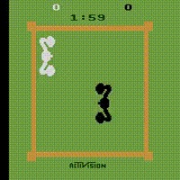
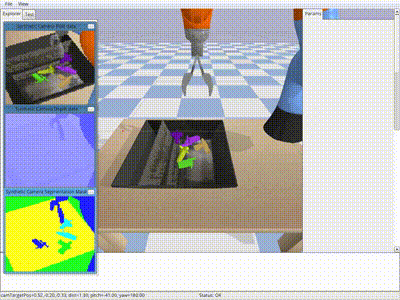
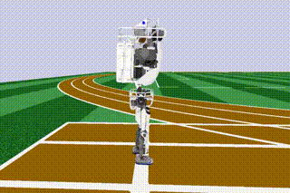
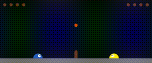

<div align="center"></div>

# PFRL
[](http://pfrl.readthedocs.io/en/latest/?badge=latest)
[](https://pypi.python.org/pypi/pfrl)

PFRL is a deep reinforcement learning library that implements various state-of-the-art deep reinforcement algorithms in Python using [PyTorch](https://github.com/pytorch/pytorch).







## Installation

PFRL is tested with Python 3.7.7. For other requirements, see [requirements.txt](requirements.txt).

PFRL can be installed via PyPI:
```
pip install pfrl
```

It can also be installed from the source code:
```
python setup.py install
```

Refer to [Installation](http://pfrl.readthedocs.io/en/latest/install.html) for more information on installation. 

## Getting started

You can try [PFRL Quickstart Guide](examples/quickstart/quickstart.ipynb) first, or check the [examples](examples) ready for Atari 2600 and Open AI Gym.

For more information, you can refer to [PFRL's documentation](http://pfrl.readthedocs.io/en/latest/index.html).

### Blog Posts
- [Introducing PFRL: A PyTorch-based Deep RL Library](https://t.co/VaT06nejSC?amp=1)
- [PFRL’s Pretrained Model Zoo](https://bit.ly/3fNx5xH)

## Algorithms

| Algorithm | Discrete Action | Continous Action | Recurrent Model | Batch Training | CPU Async Training | Pretrained models<sup>*</sup> |
|:----------|:---------------:|:----------------:|:---------------:|:--------------:|:------------------:|:------------------:|
| DQN (including DoubleDQN etc.) | ✓ | ✓ (NAF) | ✓ | ✓ | x | ✓ |
| Categorical DQN | ✓ | x | ✓ | ✓ | x | x |
| Rainbow | ✓ | x | ✓ | ✓ | x | ✓ |
| IQN | ✓ | x | ✓ | ✓ | x | ✓ |
| DDPG | x | ✓ | x | ✓ | x | ✓ |
| A3C  | ✓ | ✓ | ✓ | ✓ (A2C) | ✓ | ✓ |
| ACER | ✓ | ✓ | ✓ | x | ✓ | x |
| PPO  | ✓ | ✓ | ✓ | ✓ | x | ✓ |
| TRPO | ✓ | ✓ | ✓ | ✓ | x | ✓ |
| TD3 | x | ✓ | x | ✓ | x | ✓ |
| SAC | x | ✓ | x | ✓ | x | ✓ |

**<sup>*</sup>Note on Pretrained models**: PFRL provides pretrained models (sometimes called a 'model zoo') for our reproducibility scripts on [Atari environments](https://github.com/pfnet/pfrl/tree/master/examples/atari/reproduction) (DQN, IQN, Rainbow, and A3C) and [Mujoco environments](https://github.com/pfnet/pfrl/tree/master/examples/mujoco/reproduction) (DDPG, TRPO, PPO, TD3, SAC), for each benchmarked environment. 

Following algorithms have been implemented in PFRL:
- [A2C (Synchronous variant of A3C)](https://openai.com/blog/baselines-acktr-a2c/)
  - examples: [[atari (batched)]](examples/atari/train_a2c_ale.py)
- [A3C (Asynchronous Advantage Actor-Critic)](https://arxiv.org/abs/1602.01783)
  - examples: [[atari reproduction]](examples/atari/reproduction/a3c) [[atari]](examples/atari/train_a3c_ale.py)
- [ACER (Actor-Critic with Experience Replay)](https://arxiv.org/abs/1611.01224)
  - examples: [[atari]](examples/atari/train_acer_ale.py)
- [Categorical DQN](https://arxiv.org/abs/1707.06887)
  - examples: [[atari]](examples/atari/train_categorical_dqn_ale.py) [[general gym]](examples/gym/train_categorical_dqn_gym.py)
- [DQN (Deep Q-Network)](https://storage.googleapis.com/deepmind-media/dqn/DQNNaturePaper.pdf) (including [Double DQN](https://arxiv.org/abs/1509.06461), [Persistent Advantage Learning (PAL)](https://arxiv.org/abs/1512.04860), Double PAL, [Dynamic Policy Programming (DPP)](http://www.jmlr.org/papers/volume13/azar12a/azar12a.pdf))
  - examples: [[atari reproduction]](examples/atari/reproduction/dqn) [[atari]](examples/atari/train_dqn_ale.py) [[atari (batched)]](examples/atari/train_dqn_batch_ale.py) [[flickering atari]](examples/atari/train_drqn_ale.py) [[general gym]](examples/gym/train_dqn_gym.py)
- [DDPG (Deep Deterministic Policy Gradients)](https://arxiv.org/abs/1509.02971) (including [SVG(0)](https://arxiv.org/abs/1510.09142))
  - examples: [[mujoco reproduction]](examples/mujoco/reproduction/ddpg)
- [IQN (Implicit Quantile Networks)](https://arxiv.org/abs/1806.06923)
  - examples: [[atari reproduction]](examples/atari/reproduction/iqn)
- [PPO (Proximal Policy Optimization)](https://arxiv.org/abs/1707.06347)
  - examples: [[mujoco reproduction]](examples/mujoco/reproduction/ppo) [[atari]](examples/atari/train_ppo_ale.py)
- [Rainbow](https://arxiv.org/abs/1710.02298)
  - examples: [[atari reproduction]](examples/atari/reproduction/rainbow) [[Slime volleyball]](examples/slimevolley/)
- [REINFORCE](http://www-anw.cs.umass.edu/~barto/courses/cs687/williams92simple.pdf)
  - examples: [[general gym]](examples/gym/train_reinforce_gym.py)
- [SAC (Soft Actor-Critic)](https://arxiv.org/abs/1812.05905)
  - examples: [[mujoco reproduction]](examples/mujoco/reproduction/soft_actor_critic) [[Atlas walk]](examples/atlas/)
- [TRPO (Trust Region Policy Optimization)](https://arxiv.org/abs/1502.05477) with [GAE (Generalized Advantage Estimation)](https://arxiv.org/abs/1506.02438)
  - examples: [[mujoco reproduction]](examples/mujoco/reproduction/trpo)
- [TD3 (Twin Delayed Deep Deterministic policy gradient algorithm)](https://arxiv.org/abs/1802.09477)
  - examples: [[mujoco reproduction]](examples/mujoco/reproduction/td3)

Following useful techniques have been also implemented in PFRL:
- [NoisyNet](https://arxiv.org/abs/1706.10295)
  - examples: [[Rainbow]](examples/atari/reproduction/rainbow) [[DQN/DoubleDQN/PAL]](examples/atari/train_dqn_ale.py)
- [Prioritized Experience Replay](https://arxiv.org/abs/1511.05952)
  - examples: [[Rainbow]](examples/atari/reproduction/rainbow) [[DQN/DoubleDQN/PAL]](examples/atari/train_dqn_ale.py)
- [Dueling Network](https://arxiv.org/abs/1511.06581)
  - examples: [[Rainbow]](examples/atari/reproduction/rainbow) [[DQN/DoubleDQN/PAL]](examples/atari/train_dqn_ale.py)
- [Normalized Advantage Function](https://arxiv.org/abs/1603.00748)
  - examples: [[DQN]](examples/gym/train_dqn_gym.py) (for continuous-action envs only)
- [Deep Recurrent Q-Network](https://arxiv.org/abs/1507.06527)
  - examples: [[DQN]](examples/atari/train_drqn_ale.py)


## Environments

Environments that support the subset of OpenAI Gym's interface (`reset` and `step` methods) can be used.

## Contributing

Any kind of contribution to PFRL would be highly appreciated! If you are interested in contributing to PFRL, please read [CONTRIBUTING.md](CONTRIBUTING.md).

## License

[MIT License](LICENSE).

## Citations

To cite PFRL in publications, please cite our [paper](https://www.jmlr.org/papers/v22/20-376.html) on ChainerRL, the library on which PFRL is based:

```
@article{JMLR:v22:20-376,
  author  = {Yasuhiro Fujita and Prabhat Nagarajan and Toshiki Kataoka and Takahiro Ishikawa},
  title   = {ChainerRL: A Deep Reinforcement Learning Library},
  journal = {Journal of Machine Learning Research},
  year    = {2021},
  volume  = {22},
  number  = {77},
  pages   = {1-14},
  url     = {http://jmlr.org/papers/v22/20-376.html}
}
```
