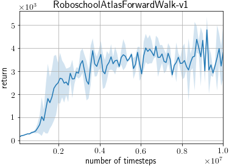

# Atlas Learning to Walk

This directory contains an example script that trains the Boston Dynamics Robot Atlas to walk using the environment `RoboschoolAtlasForwardWalk-v1` of OpenAI Roboschool.


## Files

- `train_soft_actor_critic_atlas.py`: Training and evalution of a Soft Actor-Critic agent

## Requirements

- roboschool (https://github.com/openai/roboschool)
  - You can install from PyPI: `pip install roboschool`

## How to run

Train 10M steps using 4 simulators in parallel.
```
python examples/atlas/train_soft_actor_critic_atlas.py --num-envs 4
```

Watch how the learned agent performs. `<path to agent>` must be a path to a directory where the agent was saved (e.g. `10000000_finish` and `best` created inside the output directory specified as `--outdir`). You can specify `--monitor` to write video files as MP4.
```
python examples/atlas/train_soft_actor_critic_atlas.py --demo --render --load <path to agent> [--monitor]
```

## Results

Below is the learning curve of the example script with 4 CPUs and a single GPU, averaged over three trials with different random seeds. Each trial took around 71 hours for 10M steps. After every 100K timesteps, the agent is evaluated for 20 episodes.



