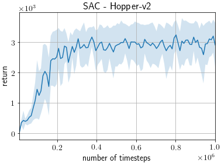
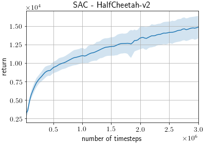
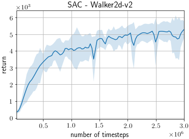
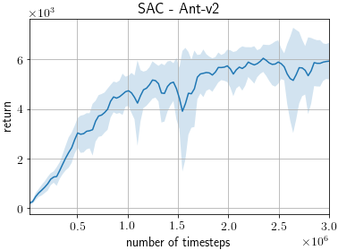
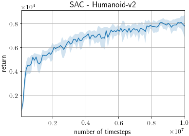

# Soft Actor-Critic (SAC) on MuJoCo benchmarks

This example trains a SAC agent ([Soft Actor-Critic Algorithms and Applications](https://arxiv.org/abs/1812.05905)) on MuJoCo benchmarks from OpenAI Gym.

## Requirements

- MuJoCo Pro 1.5
- mujoco_py>=1.50, <2.1
- torch>=1.5.0

## Running the Example

To run the training example:
```
python train_soft_actor_critic.py [options]
```

We have already pretrained models from this script for all the domains listed in the [results](#Results) section. To load a pretrained model:

```
python train_soft_actor_critic.py --demo --load-pretrained --env HalfCheetah-v2 --pretrained-type best --gpu -1
```

### Useful Options

- `--gpu`. Specifies the GPU. If you do not have a GPU on your machine, run the example with the option `--gpu -1`. E.g. `python train_soft_actor_critic.py --gpu -1`.
- `--env`. Specifies the environment. E.g. `python train_soft_actor_critic.py --env HalfCheetah-v2`.
- `--render`. Add this option to render the states in a GUI window.
- `--seed`. This option specifies the random seed used.
- `--outdir` This option specifies the output directory to which the results are written.
- `--demo`. Runs an evaluation, instead of training the agent.
- `--load-pretrained` Loads the pretrained model. Both `--load` and `--load-pretrained` cannot be used together.
- `--pretrained-type`. Either `best` (the best intermediate network during training) or `final` (the final network after training).

To view the full list of options, either view the code or run the example with the `--help` option.

## Results

PFRL scores are based on 10 trials using different random seeds, using the following command.

```
python train_soft_actor_critic.py --seed [0-9] --steps [1000000/3000000/10000000] --eval-interval [10000/50000] --env [env]
```

During each trial, the agent is trained for 1M (Hopper-v2), 3M (HalfCheetah-v2, Walker2d-v2, and Ant-v2), or 10M (Humanoid-v2) timesteps and evaluated after every 10K (Hopper-v2) or 50K (the rest) timesteps.
Each evaluation reports average return over 10 episodes without exploration noise.

### Final Average Return

Average return of last evaluation scores, averaged over 10 trials, are reported for each environment.

Reported scores are roughly approximated from learning curves of "SAC (learned temperature)" of Figure 1 in [Soft Actor-Critic Algorithms and Applications](https://arxiv.org/abs/1812.05905).

| Environment               | PFRL Score | Reported Score |
| ------------------------- |:----------:|:--------------:|
| Hopper-v2                 |    3279.25 |          ~3300 |
| HalfCheetah-v2            |   15120.03 |         ~15000 |
| Walker2d-v2               |    4875.88 |          ~5600 |
| Ant-v2                    |    5953.15 |          ~5800 |
| Humanoid-v2               |    7939.08 |          ~8000 |

### Learning Curves

The shaded region represents a standard deviation of the average evaluation over 10 trials.






