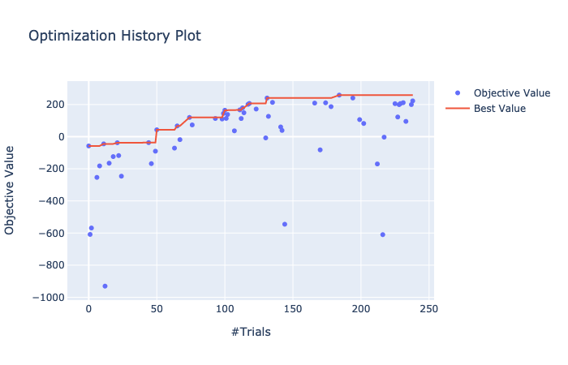

# Example of Optuna-powered Hyper-parameters Tuning

Tune hyper parameters using [Optuna](https://optuna.org/).

Although the example script (`optuna_dqn_obs1d.py`) uses fixed target algorithm/environment
(i.e., DQN and environments with 1d continuous observation space and discrete action space)
in order to fucus on the concept of Optuna-powered PFRL,
you can create one for your own use easily thanks to the Optuna's high flexibility!


## How to Run

### Quickstart

The quickstart on your local machine.

```bash
storage="sqlite:///example.db"
study="optuna-pfrl-quickstart"
pruner="HyperbandPruner"

# In RL, higher score means better performance (`--direction maximize`)
optuna create-study --study-name "${study}" --storage "${storage}" --direction maximize

# Start tuning hyper parameters
python optuna_dqn_obs1d.py --optuna-study-name "${study}" --optuna-storage "${storage}" --optuna-pruner "${pruner}"
```

You can see the optimization history of this study on [Jupyter Notebook](https://jupyter.org/install)
via the [Optuna visualization module](https://optuna.readthedocs.io/en/latest/reference/visualization.html):

```python
# On jupyter notebook
import optuna

study_name = "optuna-pfrl-quickstart"
storage = "sqlite:///example.db"
study = optuna.load_study(study_name=study_name, storage=storage)

optuna.visualization.plot_optimization_history(study)
```




If you are interested in the `--optuna-pruner` argument above, see the
[corresponding Optuna document](https://optuna.readthedocs.io/en/latest/reference/pruners.html).


### Distributed Optimization

You might have already noticed that the sample script can be executed in parallel, and distributed:

```bash
# DB specs. We assume PostgreSQL here but you can use various backend DB engines.
# Note that SQLite is not recommended for parallel optimization.
postgres_user="user"
postgres_password="password"
postgres_host="host"
postgres_database"database"

storage="postgresql://${postgres_user}:${postgres_password}@${postgres_host}/${postgres_database}"
study="optuna-pfrl-distributed"
pruner="HyperbandPruner"

optuna create-study --study-name "${study}" --storage "${storage}" --direction maximize

# You can run two processes parallelly (If your computation resource allows!)
python optuna_dqn_obs1d.py --optuna-study-name "${study}" --optuna-storage "${storage}" --optuna-pruner "${pruner}" &
python optuna_dqn_obs1d.py --optuna-study-name "${study}" --optuna-storage "${storage}" --optuna-pruner "${pruner}" &
```

```bash
# And Optuna works wherever the backend DB is accessible
ssh some-server

postgres_user="user"
postgres_password="password"
postgres_host="host"
postgres_database"database"

storage="postgresql://${postgres_user}:${postgres_password}@${postgres_host}/${postgres_database}"
study="optuna-pfrl-distributed"
pruner="HyperbandPruner"

python optuna_dqn_obs1d.py --optuna-study-name "${study}" --optuna-storage "${storage}" --optuna-pruner "${pruner}" 
```
