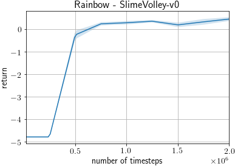

# Slime Volleyball

This directory contains an example script that learns to play Slime Volleyball using the environment `SlimeVolley-v0` of [slimevolleygym](https://github.com/hardmaru/slimevolleygym).


## Files

- `train_rainbow.py`: Training and evaluation of a Rainbow agent on `SlimeVolley-v0`.

## Requirements

- `slimevolleygym` (https://github.com/hardmaru/slimevolleygym)
  - You can install from PyPI: `pip install slimevolleygym==0.1.0`

## Algorithm

The script uses the Rainbow algorithm for training. It basically follows the set of hyperparameters described in https://arxiv.org/abs/1906.05243, often called data-efficent Rainbow.

Bellow are the differences from the original data-efficient Rainbow hyperparameters.
- A two-hidden-layer MLP is used instead of a CNN because `SlimeVolley-v0`'s observations are not pixels.
- 3-step return is used.
- The discount factor is set to 0.98.
- It is trained for 2M steps.

## How to run

Train for 2M steps using a single GPU.
```
python examples/slimevolley/train_rainbow.py
```

Watch how the learned agent performs. `<path to agent>` must be a path to a directory where the agent was saved (e.g. `2000000_finish` and `best` created inside the output directory specified as `--outdir`). You can specify `--monitor` to write video files as MP4.
```
python examples/slimevolley/train_rainbow.py --demo --render --load <path to agent> [--monitor]
```

## Results

Below is the learning curve of the example script averaged over three trials with different random seeds. Each trial took around 18 hours for 2M steps. After every ~250K timesteps, the agent is evaluated for 1000 episodes, following the protocol of https://github.com/hardmaru/slimevolleygym/blob/master/TRAINING.md#ppo-and-cma-es-example-train-directly-against-baseline-policy (https://github.com/hardmaru/slimevolleygym/blob/2aba3d2c70429ff8447f17951a528dcfd5ab7cd0/training_scripts/train_ppo.py). 

All the three trials outperform the baseline policy, i.e., achieving a positive average score over 1000 evaluation episodes, after 750K steps. The best trial among three achieved 0.541 after 1.75M steps, the model of which is used for the animation.



